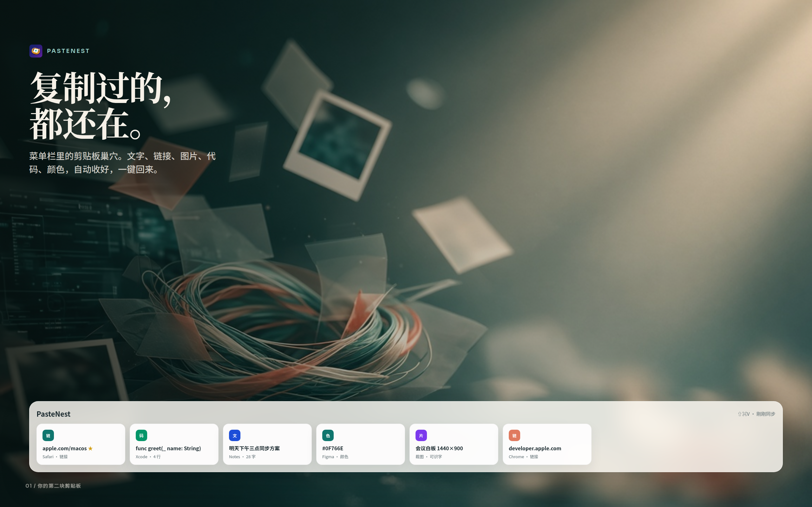
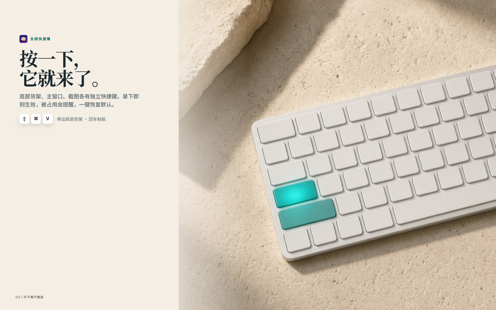
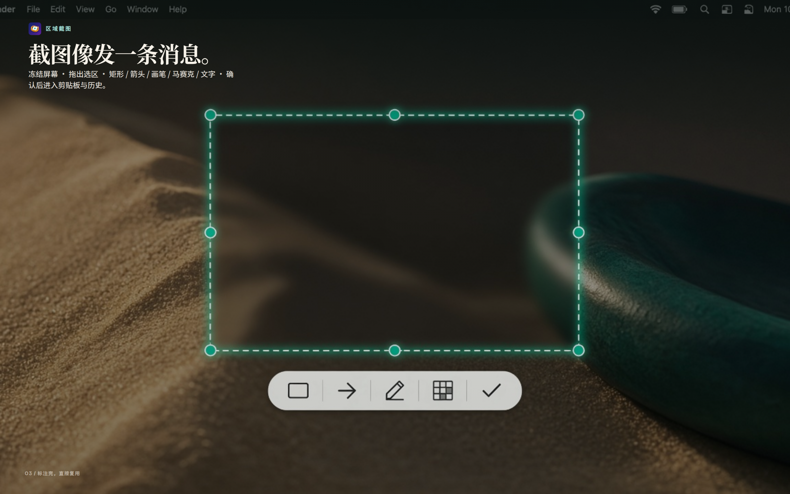
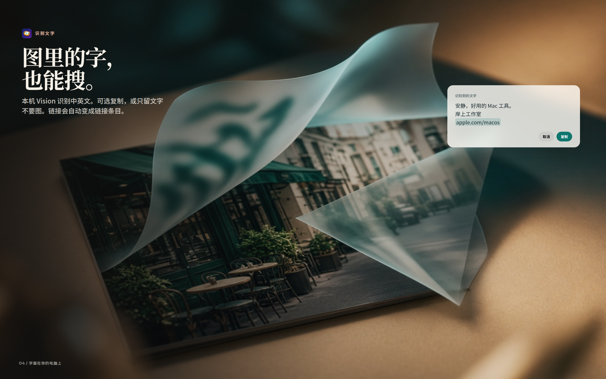
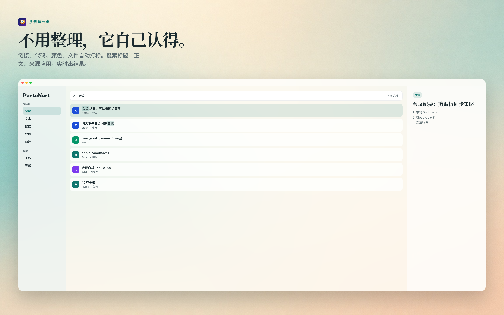
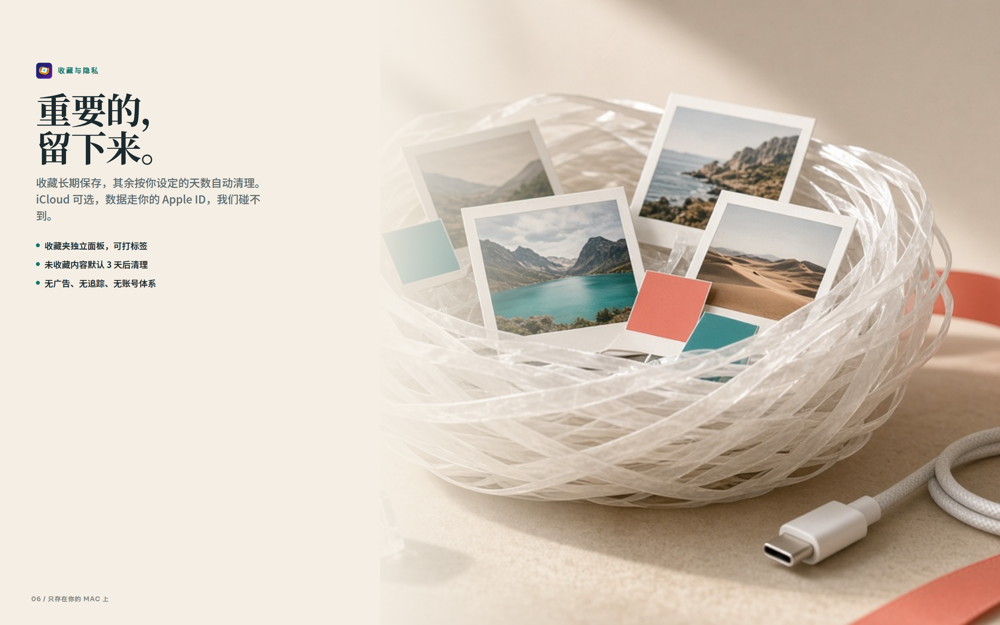

# PasteNest 功能介绍（营销 / Mac App Store）

> 一句话：**复制过的，都还在。**
> 菜单栏里的剪贴板巢穴。文字、链接、图片、代码、颜色，自动收好，一键回来。

本文给 App Store 上架、产品页、社交媒体用。截图为 **2560×1600（16:10）**，符合 Mac App Store 规格；同目录另有 1440×900。图在 `docs/app-store/screenshots/`。

---

## 为什么有人会买

每天从浏览器、聊天、IDE 里复制几十次。系统剪贴板只记得最后一条。Paste 类竞品要么订阅，要么界面像系统设置。

PasteNest 要让人在 App Store 第一屏就感到：

1. **好看** — 暖纸色、松柏绿，不像工具软件
2. **立刻懂** — 六个字「复制过的，都还在」
3. **愿意付钱** — 截图冻结标注 + 本机识字 + 收藏清理，是免费开源剪贴板没有的一套完整动作

建议定价：**一次性买断 ¥28 / $4.99**（对标 Paste 订阅的「买一次就结束」）。

---

## 图解（上架顺序）

把下面 6 张按顺序上传到 App Store Connect → macOS → 5.5" 以外的 Mac 截图位。每张只讲一件事。

### 01 英雄图 — 复制过的，都还在



**屏幕标题（写在图上）**  
复制过的，都还在。

**商店配文（截图说明，可选）**  
菜单栏里的剪贴板巢穴。文字、链接、图片、代码，一键回来。

**卖点**  
第一眼不是功能列表，是一个「巢」：所有复制物落回同一个地方。底部货架用真实卡片（链接 / 代码 / 文本 / 颜色 / 截图），让人认出这是自己的工作流。

---

### 02 快捷键 — 按一下，它就来了



**屏幕标题**  
按一下，它就来了。

**商店配文**  
⇧⌘V 底部货架，⌥⌘V 主窗口，⇧⌘X 截图。录下即刻生效。

**卖点**  
手不离开键盘。图上三颗实体键 + 松柏绿色块，比软件设置页更想按下去。强调「回车粘贴到正在用的 App」。

---

### 03 截图 — 截图像发一条消息



**屏幕标题**  
截图像发一条消息。

**商店配文**  
冻结屏幕，拖出选区，矩形 / 箭头 / 画笔 / 马赛克 / 文字，确认后进入剪贴板与历史。

**卖点**  
对标微信/QQ 截图手感，这是免费剪贴板没有的。工具条是图标，鼠标悬停才出提示，界面干净。

---

### 04 识字 — 图里的字，也能搜



**屏幕标题**  
图里的字，也能搜。

**商店配文**  
本机 Vision 识别中英文。可选复制，或只留文字不要图。

**卖点**  
「从照片上揭下一层字」的静物，比表格功能说明更想点。强调 **本机、不上传**。

---

### 05 搜索 — 不用整理，它自己认得



**屏幕标题**  
不用整理，它自己认得。

**商店配文**  
链接、代码、颜色、文件自动打标。⌘F 搜标题、正文、来源应用。

**卖点**  
主窗口三栏就是产品本身。搜索「会议」高亮命中，让人感到「我找得到」。

---

### 06 收藏 — 重要的，留下来



**屏幕标题**  
重要的，留下来。

**商店配文**  
收藏长期保存，其余按天数自动清理。iCloud 可选，我们碰不到你的数据。

**卖点**  
用「巢」收纳宝丽来与色卡，把隐私讲成质感，而不是法律条款。三条短句：标签、自动清理、无广告无追踪。

---

## App Store Connect 文案

### 名称
PasteNest

### 副标题（30 字符内）
复制过的，都还在

### 宣传文本（170 字符内，可随时改）

复制过的，都还在。PasteNest 静静待在菜单栏，收好你复制的文字、链接、图片和代码。⇧⌘V 唤出货架，回车粘贴；⇧⌘X 冻结屏幕圈选标注，图里的字也能在本机识别。无广告，无订阅。

### 描述

```
PasteNest 是常驻菜单栏的剪贴板巢穴。你复制的一切——文本、链接、图片、文件、代码、颜色——都会自动保存，随时一键找回。

【底部货架，一呼即出】
默认 ⇧⌘V，屏幕底部滑出卡片货架。回车粘贴到当前 App；双击查看完整内容。主窗口用 ⌥⌘V，两者不会同时出现。

【截图像发一条消息】
⇧⌘X 冻结当前屏幕，拖出选区，用矩形、箭头、画笔、马赛克、文字标注。确认后同时进入系统剪贴板和历史，搜「截图」就能找回。

【图里的字，也能搜】
截完在工具条点「识别文字」，本机用 Vision 识别中英文。可以复制选中的字，也可以只要文字不要图；识别出链接会自动变成链接条目。

【不用整理，它自己认得】
按类型自动打标：图片、链接、代码、颜色、文件、富文本。⌘F 搜标题、正文、来源应用和标签。收藏夹可再打上工作 / 灵感 / 代码等分类。

【重要的，留下来】
收藏的内容长期保存；未收藏的按你设定的天数自动清理（默认 3 天）。置顶也会保留。

【隐私优先】
历史默认只在你的 Mac 上。可选 iCloud 同步，数据走你的 Apple ID，开发者不可访问。无广告、无分析、无账号。

【为 Mac 而生】
原生 SwiftUI，支持 Apple Silicon 与 Intel。登录时启动，关掉窗口不会退出。快捷键在「设置 → 快捷键」录制，即刻生效，可一键恢复默认。
```

### 关键词（100 字符内）

```
剪贴板,clipboard,复制,粘贴,截图,OCR,历史,效率,Paste,snippet
```

### 此版本新功能（1.5.13）

```
• 预览操作改为纯图标，悬停显示简体 / 繁体 / 英文提示
• 截图识别文字更稳，界面文字也能认出
• 截图默认快捷键 ⇧⌘X，旧安装会自动更新
• 设置里「全部恢复默认」始终可点
```

### 英文（US 商店，建议同步上传）

**Subtitle:** Your clipboard, still here  
**Promotional text:** Everything you copy lives in the menu bar. Hit ⇧⌘V to paste again. Freeze the screen with ⇧⌘X, annotate, and read text on-device. No ads, no subscription.  
**Keywords:** clipboard,paste,copy,screenshot,OCR,history,snippet,manager,mac

**Description**

```
PasteNest is a clipboard nest that lives in your menu bar. Everything you copy — text, links, images, files, code, colors — is saved automatically, ready to come back with one tap.

【A shelf that slides up】
Press ⇧⌘V and a shelf of cards rises from the bottom. Enter pastes into the current app; double-click to see the full content. The main window has its own ⌥⌘V — the two never show at once.

【Screenshot like sending a message】
⇧⌘X freezes the screen. Drag a region, mark it up with rectangles, arrows, pen, mosaic, or text. Confirm and it lands in both your clipboard and history — search “screenshot” to find it again.

【Words in images, searchable】
Tap Recognize text on the toolbar and Vision reads Chinese and English on-device. Copy what you select, or keep only the text; recognized links become link items automatically.

【No tidying — it just knows】
Items tag themselves: image, link, code, color, file, rich text. ⌘F searches titles, bodies, source apps, and tags. Saved items can take your own labels like Work / Ideas / Code.

【What matters, stays】
Saved items keep forever; the rest clear after the days you set (3 by default). Pinned items are kept too.

【Private by default】
History stays on your Mac. iCloud sync is optional and goes through your Apple ID — we never see your data. No ads, no analytics, no accounts.

【Made for Mac】
Native SwiftUI on Apple Silicon and Intel. Launch at login; closing a window never quits. Record hotkeys in Settings → Hotkeys — they apply instantly, with one-click restore.
```

### 繁體中文（台灣 / 香港商店）

**副標題：** 複製過的，都還在  
**宣傳文本：** 複製過的，都還在。PasteNest 靜靜待在選單列，收好你複製的文字、連結、圖片和程式碼。快捷鍵喚出貨架，回車貼上；凍結螢幕圈選標註，圖裡的字也能在本機辨識。無廣告，無訂閱。  
**關鍵字：** 剪貼板,clipboard,複製,貼上,截圖,OCR,歷史,效率,Paste,snippet

**描述**

```
PasteNest 是常駐選單列的剪貼板巢穴。你複製的一切——文字、連結、圖片、檔案、程式碼、顏色——都會自動保存，隨時一鍵找回。

【底部貨架，一呼即出】
預設 ⇧⌘V，螢幕底部滑出卡片貨架。回車貼上到目前 App；雙擊查看完整內容。主視窗用 ⌥⌘V，兩者不會同時出現。

【截圖像發一條訊息】
⇧⌘X 凍結目前螢幕，拖出選區，用矩形、箭頭、畫筆、馬賽克、文字標註。確認後同時進入系統剪貼板和歷史，搜「截圖」就能找回。

【圖裡的字，也能搜】
截完在工具條點「辨識文字」，本機用 Vision 辨識中英文。可以複製選中的字，也可以只要文字不要圖；辨識出連結會自動變成連結條目。

【不用整理，它自己認得】
按類型自動打標：圖片、連結、程式碼、顏色、檔案、富文字。⌘F 搜標題、正文、來源應用和標籤。收藏夾可再打上工作 / 靈感 / 程式碼等分類。

【重要的，留下來】
收藏的內容長期保存；未收藏的按你設定的天數自動清理（預設 3 天）。置頂也會保留。

【隱私優先】
歷史預設只在你的 Mac 上。可選 iCloud 同步，資料走你的 Apple ID，開發者不可存取。無廣告、無分析、無帳號。

【為 Mac 而生】
原生 SwiftUI，支援 Apple Silicon 與 Intel。登入時啟動，關掉視窗不會結束。快捷鍵在「設定 → 快捷鍵」錄製，即刻生效，可一鍵恢復預設。
```

### 截图按语言出图

每张图都有三种语言版本，文件名带语言后缀：

| 语言 | 后缀 | 示例 |
|------|------|------|
| 简体中文 | `-zh` | `01-hero-zh-2560x1600.png` |
| 繁體中文 | `-zh-Hant` | `01-hero-zh-Hant-2560x1600.png` |
| English | `-en` | `01-hero-en-2560x1600.png` |

App Store Connect 里给「简体中文」「繁體中文」「English (U.S.)」各传对应一套。

---

## 截图制作

源文件：`docs/app-store/artboard.html?n=1&lang=zh-Hans` … `n=6&lang=en`  
渲染：`python3 docs/app-store/render_screenshots.py`（一次出 18 张）

| 文件 | 尺寸 | 用途 |
|------|------|------|
| `0N-*-2560x1600.png` | 2560×1600 | App Store Connect 首选 |
| `0N-*-1440x900.png` | 1440×900 | 备选 |

上传时 **不要** 再加设备框；画板里已经是完整营销构图。
